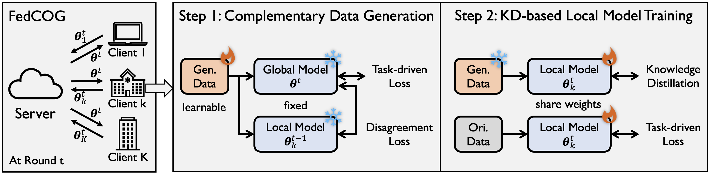

# Fake It Till Make It: Federated Learning with Consensus-Oriented Generation (FedCOG)
Federated learning with consensus-oriented generation (FedCOG), mitigates the heterogeneity level in federated learning via generating from the shared global model as consensus to complement the original data. FedCOG consists of two key components, complementary data generation to reduce heterogeneity level and knowledge-distillation-based model training to mitigate the effects of heterogeneity. Please check our [paper] (https://arxiv.org/abs/2312.05966) for details.




## Setup

Clone the repo and install the required packages.
```
git clone https://github.com/rui-ye/FedCOG
cd FedCOG
conda create -n fedcog python=3.9.15
conda activate fedcog
pip install -r requirements.txt
```

## Training
The training script is in `run.sh`.

```
python -u fedcog.py --dataset 'fashionmnist' --gpu "0" --partition 'niid' --beta 0.1 --model 'resnet18_gn' --n_parties 10 --sample_fraction 1.0 --num_local_iterations 100 --start_round 50 --comm_round 70 --save_model > $dir_path/fedcog.log
```

Key arguments:

- `dataset`: the name of dataset. We support 'cifar10', 'cifar100' and 'fashionmnist'. You may modify `cvdataset.py` if your interested dataset has not been supported.
- `gpu`: assign gpu here.
- `partition`: the data partitioning strategy, we support 'iid', 'niid' and 'noniid-skew-2'
- `beta`: the parameter for the dirichlet distribution for data partitioning.
- `model`: neural network used in training. We support 'simplecnn', 'simplecnn-mnist', 'bncnn', 'textcnn', 'resnet18-7', 'resnet18-3', 'resnet18', 'cifar100-cnn' and 'resnet18_gn'.
- `n_parties`: the number of clients participated in federated learning.
- `sample_fraction`: the proportion of clients are sampled in each round.
- `num_local_iterations`: number of local iterations.
- `start_round`: the first round to implement generation for FedCOG.
- `comm_round`: the number of maximum communication roun
- `save_model`: the hyperparameter to decide whether to save the global model at the end.

We also provide implementation of FedAvg, FedAvgM, MOON and FedProx algorithms in `run.sh`.

## Citation

Please cite our paper if you find the repository helpful. See other projects and papers at [Rui Ye's Homepage](https://rui-ye.github.io/).

```
@inproceedings{ye2023fake,
  title={Fake It Till Make It: Federated Learning with Consensus-Oriented Generation},
  author={Ye, Rui and Du, Yaxin and Ni, Zhenyang and Chen, Siheng and Wang, Yanfeng},
  booktitle={The Twelfth International Conference on Learning Representations},
  year={2023}
}
